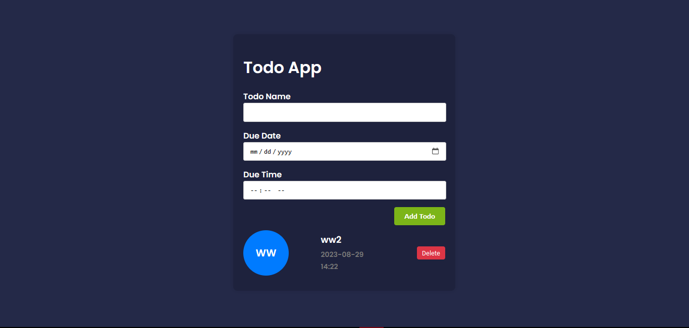

# Todo App

A simple and responsive todo app that allows you to manage your tasks effectively. Add, view, and delete tasks with due dates and times.



## Features

- Add new todos with names, due dates, and times.
- View your todos with a clean and organized interface.
- Delete todos you no longer need.

## Getting Started

### Prerequisites

- Web browser

### Installation

1. Clone the repository:

   ```sh
   git clone https://github.com/Oluwaseg/todo-app.git
   ```

### Usage

- Enter the name of the task in the "Todo Name" field.
- Click the "Add Todo" button to add the task to your list.
- View your todos with their names.
- To delete a todo, click the "Delete" button next to it.

### Contributing

- Contributions are welcome! Please fork the repository and create a pull request.

### License

- This project is licensed under the MIT License - see the LICENSE file for details.

This README now includes navigation links, a more detailed "Getting Started" section, and the requested "Usage" and "License" sections. Remember to replace `yourusername` in the repository URL and customize the installation instructions, usage, and contributing sections as needed.
